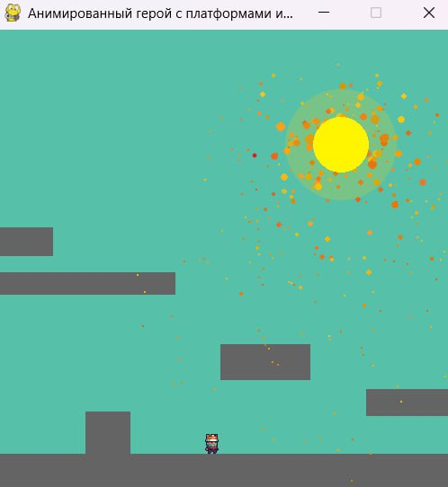

# Анимирванный платформер


**Это простая 2D игра-платформер, где вы управляете королем, который пытается достичь своей башни**

---

## Описание

Вы управляете корлем, который умеет двигаться вправо, влево и прыгать. Ваша задача дойти до самого верха.

---

## Управление

- **W** - прыжок
- **A** - двигаться влево
- **D** - двигаться вправо

---

## Технические требования

- Python 3.x  
- Pygame

---

## Установка

Следуйте этим шагам для запуска игры на разных системах:

### 1. Клонирование репозитория

```bash
# Перейдите в папку, где хотите разместить игру
cd /путь/до/вашей/папки

# Клонируйте репозиторий
git clone https://github.com/konstantinbatorov/AnimationGame.git
```

### 2. Создайте виртуальное окружение

- **На Windows:**

```bash
python -m venv venv
```

- **На macOS и Linux:**

```bash
python3 -m venv venv
```

### 3. Активируйте виртуальное окружение

- **На Windows:**

```bash
venv\Scripts\activate
```

- **На macOS и Linux:**

```bash
source venv/bin/activate
```

### 4. Перейдите в папку проекта

```bash
cd AnimationGame
```

### 5. Установите необходимые зависимости

```bash
pip install -r requirements.txt
```

### 6. Запустите игру

```bash
python app.py
# или, если используете macOS/Linux и python3:
python3 app.py
```

---

## Советы по установке на macOS и Linux

Убедитесь, что у вас установлен Python 3 и pip. В случае отсутствия pip выполните:

```bash
python3 -m ensurepip --upgrade
```

Все остальные шаги аналогичны.

---

## Контакты и поддержка

Вопросы, предложения или идеи — пишите на: **plobuk5@gmail.com**


---
